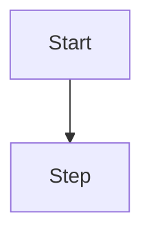

# REF — CSS & Rendering Contract

How the vault renders content and what syntax agents must use to stay consistent.

---

## Active CSS Snippets

One snippet is enabled: **`notion-code`** (`00_System/Snippets/notion-code.css` — loaded via `.obsidian/appearance.json`).

### What it does

Styles all inline code blocks in Notion's dark-mode appearance:
- Text color: `#eb5757` (coral/red)
- Background: `#2a2a2a` (soft dark grey)
- Rounded corners, no border

This applies to:
- Reading view: `.markdown-rendered code`
- Live editor: `.cm-inline-code`

---

## Rule: Always use backtick syntax for inline code

```
CORRECT → `some_method_name`, `IAI-1240`, `procore_files`

WRONG   → <code>some_method_name</code>
WRONG   → **some_method_name** (bold is not code)
```

The CSS snippet only fires on backtick-delimited inline code. HTML `<code>` tags will not be styled and will render inconsistently.

---

## Fenced code blocks

Use triple backticks with a language hint where possible. This vault contains Ruby, SQL, YAML, and shell examples.

````
```ruby
def upload_signature; end
```

```sql
SELECT * FROM incident_witness_statements;
```

```yaml
type: ticket
status: In Progress
```
````

---

## Mermaid diagrams

Obsidian renders Mermaid natively in any `.md` file. Use a fenced code block with `mermaid` as the language:

````

````

For diagrams you want to zoom/pan interactively, use Excalidraw instead: create a `[[Drawing Name.excalidraw]]` wikilink in your note, click it, and the Excalidraw plugin opens an empty canvas. Use Cmd+P → "Insert Mermaid" inside Excalidraw to convert Mermaid syntax into a zoomable canvas. All Excalidraw files are saved to `00_System/Drawings/` automatically.

---

## Callouts / Admonitions

Obsidian supports callout syntax. Existing notes use `[!question]` callouts. Preserve these if encountered:

```
> [!question]- Question title
> Content here
```

Do not convert callouts to plain blockquotes when migrating content.

---

## Obsidian-specific syntax to preserve

| Syntax | Meaning | Action |
|---|---|---|
| `[[Note Name]]` | Wikilink | Always use, never convert to `[text](path.md)` |
| `![[filename.png]]` | Embedded image | Preserve as-is |
| `- [ ]` | Unchecked task | Preserve, never auto-check |
| `- [x]` | Checked task | Preserve, never uncheck |
| `- [ ] ❓` | Open question | The vault's question tracking convention — preserve |
